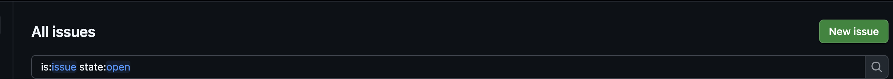
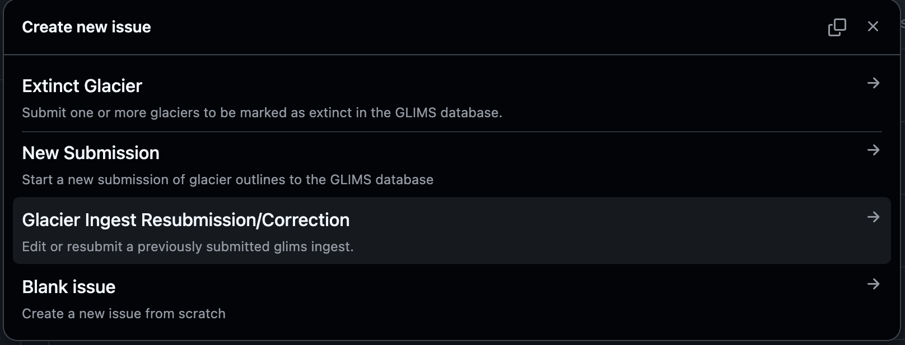

# Re-submit Glacier Outlines or Correction to GLIMS

There are times when a glacier outline, already ingested to the GLIMS Glacier Database, may need to be revised. This includes revision to the glacier outline or corresponding metadata (e.g. instrument, analyst).

The Re-submission form allows Data Providers to flag a revision need, and provide the NSIDC DAAC Team with the information necessary to make a change in the Database.

## Before You Submit

Before opening a re-submission, identify the submission that needs to be corrected. You will need:

* The **original submission ID** (the `Submission_Info` ID in the GLIMS database)
* The **RC ID** or region label associated with the original submission
* A link to the GitHub issue or documentation from the original submission

To find **original submission ID** or **RC ID**  query the [GLIMS submissions API](https://www.glims.org/services/submissions). Each record in the response includes a submission_id and rc_id. You can identify your submission by attributes such as submitter name, institution (chief_affl), region, or submission date (subm_time).

If you are unsure which submission needs correcting, you can search the [GLIMS Glacier Viewer](https://www.glims.org/maps/glims). If the data you want to submit does not correspond to any existing submission, use the [new submission form](https://github.com/glims-nsidc/glims-submissions/issues) instead as this form is only for changes to data that has already been submitted.

## Required Information

For each re-submission or correction, you will need the following:

**Original submission ID(s)** — The `Submission_Info` ID, RC ID, or other identifier for the submission(s) being corrected or resubmitted.

**Link to previous submission** (optional) — The URL of the GitHub issue for the original submission, if available. This helps the analyst quickly pull up the full history of the original request. Trello link or documentation from prior emails is also acceptable here as this transition to github is still ongoing.

**Reason for resubmission** — A short categorization of why the resubmission is needed. Dropdown options include:
* Geometry/outline correction
* Metadata error (e.g. `rc_id`, `region_label`, `submitter_id`)
* Instrument/session info correction
* Analyst assignment correction
* New or corrected data from submitter
* Other (explained in the notes field)

**Scope of change** — One or more checkboxes indicating what the resubmission affects: outlines/geometry, attribute/metadata only, instrument or session info, and/or analyst assignment. This helps the analyst anticipate whether a full delete-and-reingest is required or whether the issue can be resolved with a direct SQL correction.

**Additional notes** — Any context useful for the analyst processing the request: why the correction is needed, what specifically changed, and anything unusual about the original ingest that might affect how the correction should be handled.

## How to Submit

Re-submissions are handled through the GLIMS submissions GitHub repository using an issue form.

1. Navigate to the [glims-submissions repository](https://github.com/glims-nsidc/glims-submissions/issues)
2. Click **New Issue**. 
3. Select the **Glacier Ingest Resubmission/Correction** template. 
4. Fill in the title with a brief description, for example: `Ingest Re-submission/Correction: Norway 2024/2025 outlines`.
5. Enter information into form fields.
8. Click **Submit new issue**.

## After Issue Submission

Once submitted, the re-submission will be reviewed by the NSIDC DAAC team. You may be contacted with questions before the data are revised. The records will be visible in the GLIMS Glacier Viewer as soon as they are updated.

## Questions

For questions, please contact NSIDC User Services at nsidc@nsidc.org.
